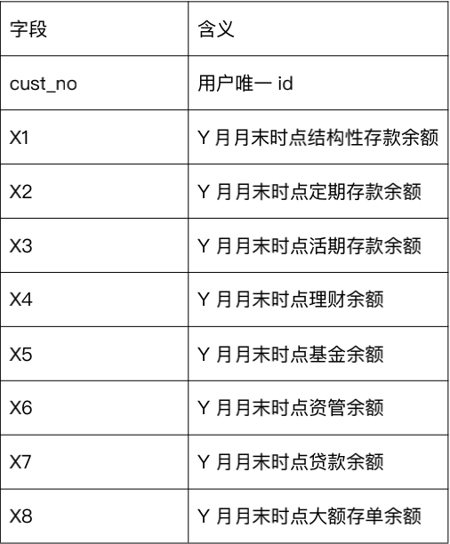
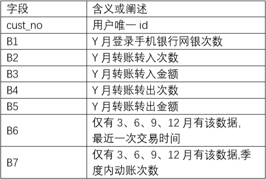
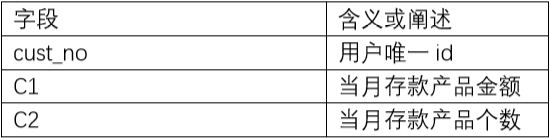
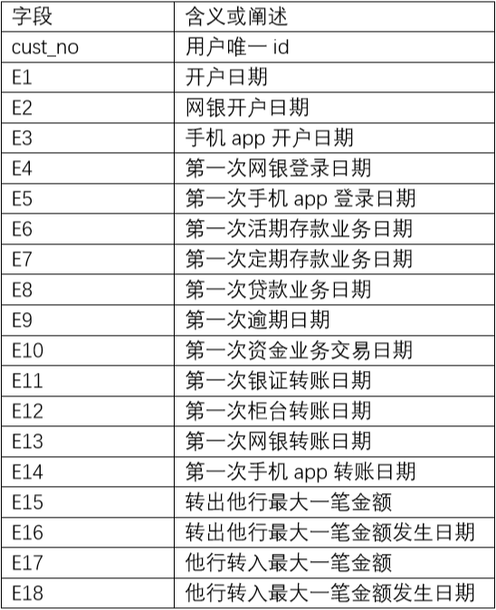
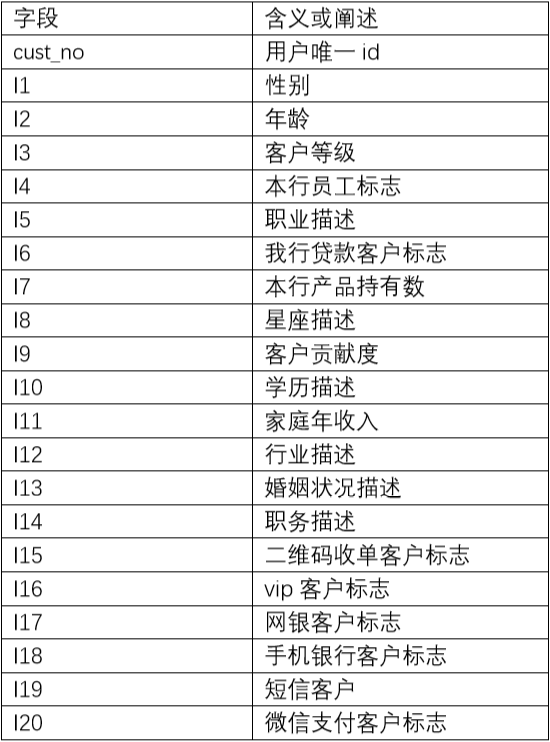

# [厦门国际银行数创金融杯建模大赛2020](https://www.dcjingsai.com/v2/cmptDetail.html?id=439)

---

# 1. 竞赛背景

在数字金融时代，大数据、人工智能技术在银行业内的发展日新月异，业内各机构都在加速数字化转型发展。厦门国际银行作为有特色的科技领先型中小银行，多年来始终坚持发挥数字金融科技力量，践行“数字赋能”理念，持续推进智慧风控、智慧营销、智慧运营、智慧管理，运用人工智能和大数据分析技术建立智能化客户服务模式和金融智慧营销服务体系，提升营销过程的智慧化、精准化水平，在为客户提供更贴心更具可用性的金融服务。

厦门国际银行联合厦门大学数据挖掘研究中心，为搭建一个行业交流平台，与社会各界精英共同探索机器学习和人工智能等热门技术问题，携手DataCastle数据城堡共同举办“2020第二届厦门国际银行“数创金融杯”建模大赛“。本届大赛以“金融+科技”为理念，着力于金融营销中的真实场景，总奖金达31万元。

---

# 2. 竞赛任务（三分类）

随着科技发展，银行陆续打造了线上线下、丰富多样的客户触点，来满足客户日常业务办理、渠道交易等客户需求。面对着大量的客户，银行需要更全面、准确地洞察客户需求。在实际业务开展过程中，需要发掘客户流失情况，对客户的资金变动情况预判；提前/及时针对客户进行营销，减少银行资金流失。本次竞赛提供实际业务场景中的客户行为和资产信息为建模对象，一方面希望能借此展现各参赛选手的数据挖掘实战能力，另一方面需要选手在复赛中结合建模的结果提出相应的营销解决方案，充分体现数据分析的价值。

* -1：表示用户资金流出
* 0 ：表示用户资金不变
* 1 ：表示用户资金流入

---

# 3. 竞赛数据

1.  数据总体概述 本次数据共分为两个数据集，x_train.rar, y_train.rar 和x_test.rar,其中x_train.rar内含训练集的特征, y_train.rar 为训练集的目标变量。训练集由两个季度的数据抽样样本组成。x_test.rar为测试集特征，特征变量与训练集一致。建模的目标即根据训练集对模型进行训练，并对测试集进行预测。

2.  表和数据字段说明 训练集主要为3、4季度的抽样数据，测试集为1季度的抽样数据。

### aum_m(Y)：第Y月的月末时点用户资产数据

### behavior_m(Y)：第Y月的用户行为数据

### cunkuan_m(Y)：第Y月的存款数据

### big_event_Q(Z)：第Z季度用户重大历史数据

### cust_avli_Q(Z)：第Z季度的有效客户

* cust_no

### cust_info_q(Z)：第Z季度的客户信息

---

# 4. 评分标准

### kappa

Kappa系数是一个用于一致性检验的指标，也可以用于衡量分类的效果。因为对于分类问题，所谓一致性就是模型预测结果和实际分类结果是否一致。kappa系数的计算是基于混淆矩阵的，取值为-1到1之间,通常大于0。

基于混淆矩阵的kappa系数计算公式如下：

$kappa = \frac{P_0 - P_e}{1 - P_e}$

其中：

$P_0 = \frac{对角线元素之和}{整个混淆矩阵元素之和} = ACC$

$P_e = \frac{\sum_i 第i行元素之和 * 第i列元素之和}{(\sum 矩阵所有元素)^2}$

$P_e$ 即所有类别分别对应的""实际与预测数量的乘积""，之总和，除以""样本总数的平方""

为什么要使用kappa？

分类问题中，最常见的评价指标是acc，它能够直接反映分正确的比例，同时计算非常简单。但是实际的分类问题种，各个类别的样本数量往往不太平衡。在这种不平衡数据集上如不加以调整，模型很容易偏向大类别而放弃小类别(eg: 正负样本比例1:9，直接全部预测为负，acc也有90%。但正样本就完全被“抛弃”了)。此时整体acc挺高，但是部分类别完全不能被召回。

这时需要一种能够惩罚模型的“偏向性”的指标来代替acc。而根据kappa的计算公式，越不平衡的混淆矩阵， $P_e$ 越高，kappa值就越低，正好能够给“偏向性”强的模型打低分。

---

# 5. 参考资料

[OTTO Baseline](https://mp.weixin.qq.com/s/Y9bDEtQS94HkWxHOI8hYVw)